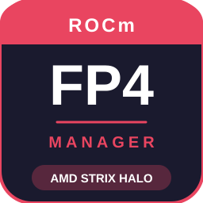

# ROCmFP4 Manager

Desktop GUI to **download, configure and run** GGUF models in **ROCmFP4** format on **AMD Strix Halo** — without touching the command line.



## Features

- **Model management** — HuggingFace search & download, LM Studio import, multi-part and MTP support
- **Visual configuration** — Context, batch, K/V cache, MTP, flash attention, all via sliders
- **Server control** — Start/Stop/Restart, live logs, API URLs displayed
- **Built-in chat** — Discussion interface with streaming, markdown, and history
- **Built-in bench** — Performance tests with `llama-bench`, multi-run, CSV/JSON export
- **Auto-start** — systemd service to launch the app and/or server at boot
- **Theme support** — Dark/Light themes with customizable accent and background colors
- **Auto-update** — Check and install new versions from GitHub releases

## Requirements

- **AMD Strix Halo** (Radeon 8060S / gfx1151)
- **Linux 6.17+** with Mesa 25.2.8+
- **Python 3.11+**
- **Git**
- **[ROCmFPX](https://github.com/charlie12345/ROCmFPX)** (fork of llama.cpp with AMD-optimized kernels)

## Installation

```bash
# 1. Clone
git clone https://github.com/Yohan30/ROCmFP4-Manager.git
cd ROCmFP4-Manager

# 2. Install Python dependencies
pip install -r requirements.txt

# 3. Launch
python src/main.py
```

The app will detect if ROCmFPX is installed and offer to clone/build it.

## Quick Start

1. **ROCmFPX tab** → Clone and build (first time only)
2. **Models tab** → Search and download a model, or import from LM Studio
3. **Configuration tab** → Select the model, adjust settings
4. **Server tab** → Click "Start"
5. **Chat tab** → Chat with the model!

## Default Port

- Web UI + API: **`http://localhost:1412`**
- Chat API: `http://localhost:1412/v1/chat/completions`

## Tech Stack

- **Python 3** / **PySide6 (Qt6)**
- **[ROCmFPX](https://github.com/charlie12345/ROCmFPX)** (llama.cpp fork with AMD-optimized kernels)
- **systemd** (auto-start)
- **HuggingFace Hub** (model download)

## Author

**Necti** — [github.com/Yohan30](https://github.com/Yohan30)

## License

MIT
